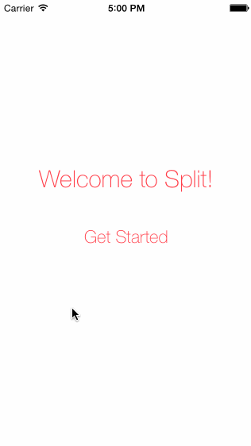

# Split - Swift wireframe

This is a wireframe of an iOS application called Split, which takes in the restaurant and your buddies' names and split the bill correctly - tax and tip included. :) 

Time spent: 1 hours spent in total

Completed user stories:

 * [x] Required: 3+ wireframe screens, walking through the majority of the app. 
 
Notes:

Walkthrough of all user stories:

GIF created with [LiceCap](http://www.cockos.com/licecap/).
